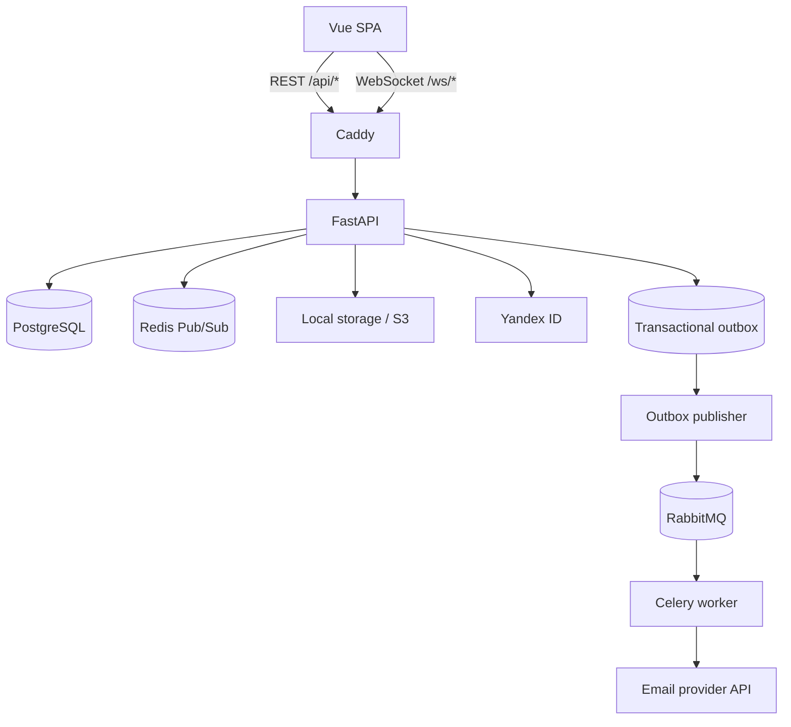
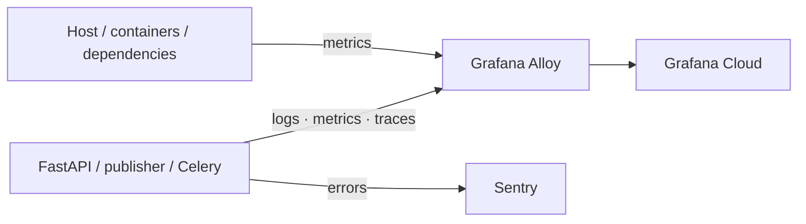

# Kantano

Kantano - веб-приложение для совместной работы с задачами в формате Kanban. Проекты,
роли, приглашения, карточки и присутствие участников синхронизируются между открытыми
вкладками без перезагрузки страницы.

[Открыть Kantano](https://kantano.ru)


## Навигация

- [Быстрый старт](#быстрый-старт)
- [Архитектура](#архитектура)
- [Стек](#стек)
- [Эксплуатация](#эксплуатация)
- [Observability](#Observability)
- [Интеграции](#интеграции)
- [Возможности](#возможности)
- [Проверки](#проверки)
- [Документация](#документация)

## Возможности

- проекты с ролями `OWNER`, `MANAGER` и `MEMBER`;
- настраиваемые колонки и drag-and-drop задач;
- исполнители, теги, приоритеты, дедлайны и фильтры;
- приглашения по ссылке или QR-коду с ограничением срока и числа использований;
- регистрация с подтверждением email и вход через Yandex ID;
- realtime-обновления доски, списка проектов и состава участников;
- индикаторы присутствия: видно, кто находится на доске, просматривает или редактирует задачу;
- профили пользователей и аватары в локальном или S3-compatible хранилище.

## Архитектура



Backend разбит на функциональные модули. Роутеры передают запросы в use cases, работа с
SQLAlchemy изолирована в repositories, а границы транзакций принадлежат `UnitOfWork`.
Realtime-события публикуются только после успешного commit и доставляются
между backend-процессами через Redis Pub/Sub.

При регистрации пользователь создаётся только после перехода по ссылке из письма и
задания пароля. Намерение отправить письмо сохраняется в PostgreSQL вместе с заявкой,
после чего outbox publisher передаёт задачу через RabbitMQ в Celery worker. Worker
обращается к внешнему email API через общий gateway-интерфейс.

Во frontend используется сгенерированный из OpenAPI TypeScript-клиент. Access token хранится
в памяти, refresh token - в `HttpOnly` cookie. При восстановлении страницы SPA обновляет
access token через backend и повторно подключает WebSocket-каналы.

Подробнее: [архитектура проекта](./docs/architecture.md).

## Стек

| Часть | Технологии |
|---|---|
| Frontend | Vue 3, TypeScript, Vite, Pinia, PrimeVue, Tailwind CSS |
| Backend | Python 3.12, FastAPI, Pydantic, SQLAlchemy AsyncIO, Alembic |
| Данные | PostgreSQL 15, Redis 7, RabbitMQ 4, local/S3-compatible storage |
| Фоновые задачи | Celery, transactional outbox, email gateway |
| Тестирование | pytest, pytest-asyncio, Vitest, Vue Test Utils |
| Observability | OpenTelemetry, Grafana Alloy, Prometheus, Loki, Tempo, Grafana Cloud, Sentry |
| Инфраструктура | Docker Compose, Caddy, GitHub Actions, GHCR |

## Эксплуатация

- CI/CD в GitHub Actions: сборка и публикация образов в GHCR, деплой на VPS через Docker Compose;
- TLS termination и reverse proxy на Caddy; liveness/readiness-проверки приложения после деплоя;
- единый telemetry pipeline для API, фоновых процессов, инфраструктуры и внешних зависимостей;
- ежедневные согласованные backup PostgreSQL: `pg_dump` → зашифрованный Restic repository в отдельном private S3 bucket;
- валидация дампа до загрузки, retention до четырёх snapshot и мониторинг выполнения через PingZen Heartbeat.

Параметры production-деплоя, backup и процедуры восстановления описаны в
[руководстве по эксплуатации](./docs/deployment.md).

## Observability



FastAPI, outbox publisher и Celery worker формируют структурированные JSON-логи,
Prometheus-метрики и OpenTelemetry traces. Grafana Alloy объединяет прикладные сигналы с
метриками Linux, Docker, PostgreSQL, Redis и RabbitMQ и отправляет их в Grafana Cloud.
Sentry используется отдельно для backend errors, без дублирования log и trace pipeline.

Контекст запроса сохраняется при переходе через transactional outbox, RabbitMQ и Celery.
По `request_id` из HTTP-ответа можно найти access log, перейти к полному Tempo trace и
сопоставить ошибку с Sentry event. Labels ограничены стабильными значениями: route
template, service, environment и тип результата; пользовательские идентификаторы в
metrics labels не попадают.

В Grafana подготовлены три dashboard:

- API: request rate, статусы, error ratio, latency и состояние database pool;
- background и realtime: outbox, publisher, Celery, RabbitMQ и WebSocket;
- infrastructure: host/container resources, зависимости и состояние telemetry export.

Production alerts контролируют доступность компонентов, 5xx и latency, фоновые очереди,
ресурсы VPS, OOM, сбои экспорта и квоту Grafana Cloud. Локально тот же контур запускается
на Prometheus, Loki, Tempo и Grafana через отдельный Compose overlay. Архитектура,
dashboards, метрики и сценарии диагностики описаны в
[руководстве по Observability](./docs/observability.md).

## Интеграции

| Назначение | Текущая реализация |
|---|---|
| Транзакционные письма | Resend HTTPS API через `EmailGateway` |
| Внешний вход | Yandex ID OAuth |
| Файлы | Локальное или S3-compatible хранилище |

## Быстрый старт

В проекте используется [Taskfile](./Taskfile.yml): основные сценарии локальной
разработки — настройка, запуск dev-окружения, observability, тесты, проверки, миграции
и генерация API — уже собраны в готовые команды. Не нужно вручную составлять длинные
команды Docker, `uv` и `pnpm`. Список команд: `task --list`; подробности о сценарии:
`task --summary <task>`. Точный состав шагов каждой команды можно посмотреть в
[`Taskfile.yml`](./Taskfile.yml).

Для запуска нужны [Task](https://taskfile.dev/installation/) v3, Docker с Compose,
Python 3.12 и `uv`, Node.js 24, pnpm 9 или 10 и OpenSSL.

Все Task-команды выполняются из корня репозитория. Полный список: `task --list`.
Подробности о задаче: `task --summary <task>`.

### 1. Настройте проект

```bash
task setup  # создать локальные env/JWT-ключи и установить зависимости
```

Команда создаёт отсутствующие локальные env-файлы и JWT-ключи, устанавливает backend и
frontend зависимости и настраивает pre-commit hooks. Существующие env-файлы и ключи не
перезаписываются.

### 2. Запустите приложение

```bash
task dev  # поднять backend-инфраструктуру и запустить frontend
```

Task поднимет PostgreSQL, Redis, RabbitMQ, backend, Celery worker и outbox publisher в
Docker, применит миграции, подготовит локальное хранилище аватаров и запустит frontend
через Vite. После `Ctrl+C` Docker-сервисы останутся работать; остановить их можно через
`task dev:down`.

Для реальной отправки писем в локальном `.env` требуется
`LIGHTTASK_CONFIG__RESEND__API_KEY`. После запуска доступны:

- API: `http://localhost:8000/api`;
- Swagger UI: `http://localhost:8000/docs`;
- liveness: `http://localhost:8000/api/health`;
- readiness (проверка PostgreSQL): `http://localhost:8000/api/health/ready`.

Yandex OAuth и внешнее S3-хранилище для локальной разработки необязательны.
Локальное окружение вместе с Grafana, Prometheus, Loki, Tempo и Alloy запускается через
`task obs`. Адреса интерфейсов и диагностические сценарии приведены в
[руководстве по Observability](./docs/observability.md).

Приложение откроется на `http://localhost:5173`. Vite проксирует `/api` и `/ws` в
локальный backend, поэтому `VITE_API_URL` можно оставить пустым.

Полная инструкция: [локальная разработка](./docs/development.md).

## Проверки

```bash
task check  # выполнить lint, typecheck, проверки конфигов, все тесты и frontend build
```

Для целевых прогонов:

```bash
task test:backend:unit  # быстрые unit-тесты backend без Docker
task test:backend       # полный набор backend-тестов с тестовыми контейнерами
task test:frontend      # frontend-тесты Vitest
```

Тесты backend по умолчанию используют отдельные PostgreSQL, Redis и RabbitMQ из
`docker-compose.test.yml` и отказываются работать с dev-базой. Подробности и отдельные
команды запуска есть в [руководстве по тестированию](./docs/testing.md).

## Документация

- [Карта документации](./docs/README.md)
- [Архитектура](./docs/architecture.md)
- [Локальная разработка](./docs/development.md)
- [Тестирование](./docs/testing.md)
- [Деплой и эксплуатация](./docs/deployment.md)
- [Observability и диагностика](./docs/observability.md)
- [Backend](./backend/light_task/README.md)
- [Frontend](./frontend/light-task-frontend/README.md)
