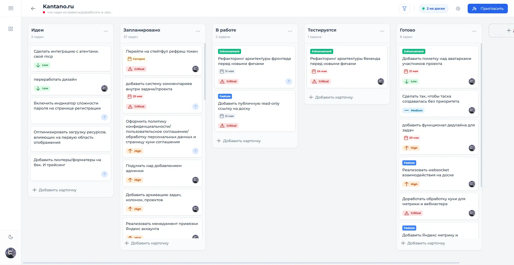
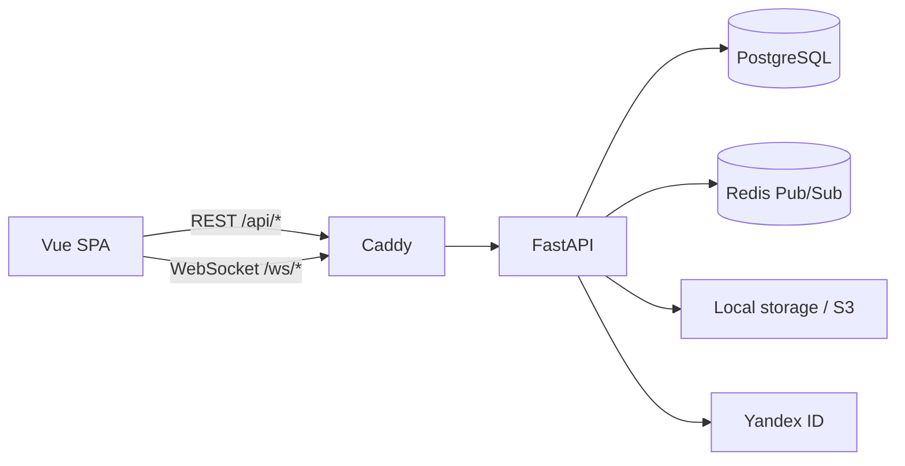

# Kantano

Kantano - веб-приложение для совместной работы с задачами в формате Kanban. Проекты,
роли, приглашения, карточки и присутствие участников синхронизируются между открытыми
вкладками без перезагрузки страницы.

[Открыть Kantano](https://kantano.ru)



## Навигация

- [Быстрый старт](#быстрый-старт)
- [Архитектура](#архитектура)
- [Стек](#стек)
- [Возможности](#возможности)
- [Проверки](#проверки)
- [Документация](#документация)

## Возможности

- проекты с ролями `OWNER`, `MANAGER` и `MEMBER`;
- настраиваемые колонки и drag-and-drop задач;
- исполнители, теги, приоритеты, дедлайны и фильтры;
- приглашения по ссылке или QR-коду с ограничением срока и числа использований;
- регистрация по email и вход через Yandex ID;
- realtime-обновления доски, списка проектов и состава участников;
- индикаторы присутствия: видно, кто находится на доске, просматривает или редактирует задачу;
- профили пользователей и аватары в локальном или S3-compatible хранилище.

## Архитектура



Backend разбит на функциональные модули. Роутеры передают запросы в use cases, работа с
SQLAlchemy изолирована в repositories, а границы транзакций принадлежат `UnitOfWork`.
Realtime-события публикуются только после успешного commit и доставляются
между backend-процессами через Redis Pub/Sub.

Во frontend используется сгенерированный из OpenAPI TypeScript-клиент. Access token хранится
в памяти, refresh token - в `HttpOnly` cookie. При восстановлении страницы SPA обновляет
access token через backend и повторно подключает WebSocket-каналы.

Подробнее: [архитектура проекта](./docs/architecture.md).

## Стек

| Часть | Технологии |
|---|---|
| Frontend | Vue 3, TypeScript, Vite, Pinia, PrimeVue, Tailwind CSS |
| Backend | Python 3.12, FastAPI, Pydantic, SQLAlchemy AsyncIO, Alembic |
| Данные | PostgreSQL 15, Redis 7, local/S3-compatible storage |
| Тестирование | pytest, pytest-asyncio, Vitest, Vue Test Utils |
| Инфраструктура | Docker Compose, Caddy, GitHub Actions, GHCR |

## Быстрый старт

Для запуска нужны Docker с Compose, Node.js 24, pnpm 9 и OpenSSL.

### 1. Настройте backend

```bash
cp .env.template .env

mkdir -p backend/light_task/certs
openssl genrsa -out backend/light_task/certs/jwt-private.pem 2048
openssl rsa \
  -in backend/light_task/certs/jwt-private.pem \
  -pubout \
  -out backend/light_task/certs/jwt-public.pem

docker compose -f docker-compose.dev.yml up --build
```

После запуска Compose поднимет PostgreSQL, Redis и backend, применит миграции и подготовит локальное
хранилище аватаров. После запуска доступны:

- API: `http://localhost:8000/api`;
- Swagger UI: `http://localhost:8000/docs`;
- health check: `http://localhost:8000/api/health`.

Yandex OAuth и внешнее S3-хранилище для локальной разработки необязательны.

### 2. Запустите frontend

В отдельном терминале:

```bash
cd frontend/light-task-frontend
pnpm install
cp .env.template .env
pnpm dev
```

Приложение откроется на `http://localhost:5173`. Vite проксирует `/api` и `/ws` в
локальный backend, поэтому `VITE_API_URL` можно оставить пустым.

Полная инструкция: [локальная разработка](./docs/development.md).

## Проверки

Backend:

```bash
docker compose -f docker-compose.test.yml up -d
cd backend/light_task
uv sync --group dev
uv run ruff check .
uv run ruff format --check .
uv run basedpyright
uv run pytest -q
```

Frontend:

```bash
cd frontend/light-task-frontend
pnpm test:unit
pnpm build
```

Тесты backend по умолчанию используют отдельные PostgreSQL и Redis из
`docker-compose.test.yml` и отказываются работать с dev-базой. Подробности и отдельные
команды запуска есть в [руководстве по тестированию](./docs/testing.md).

## Документация

- [Карта документации](./docs/README.md)
- [Архитектура](./docs/architecture.md)
- [Локальная разработка](./docs/development.md)
- [Тестирование](./docs/testing.md)
- [Деплой и эксплуатация](./docs/deployment.md)
- [Backend](./backend/light_task/README.md)
- [Frontend](./frontend/light-task-frontend/README.md)
