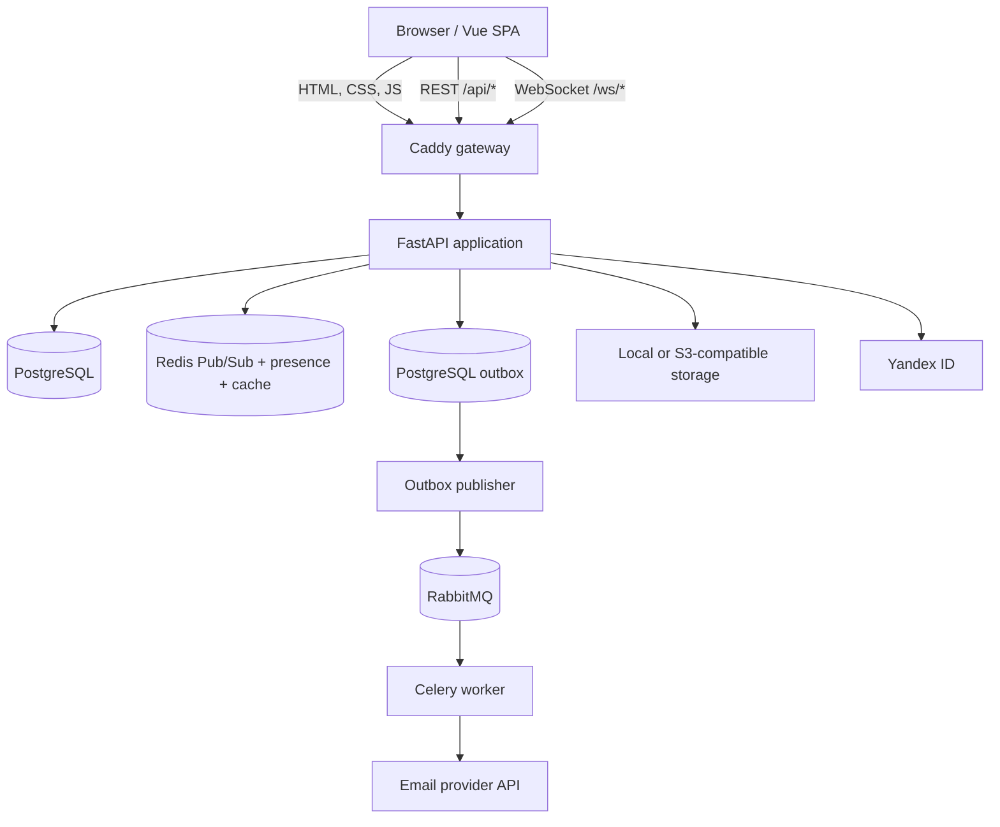
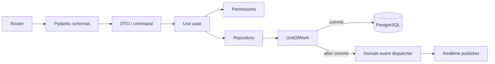
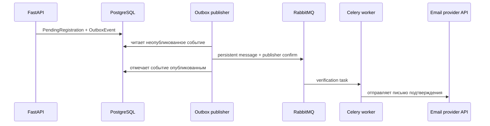
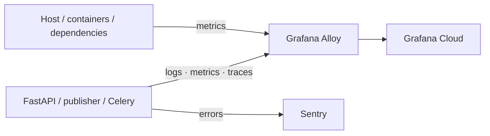

# Архитектура Kantano

Kantano состоит из Vue SPA, FastAPI backend, PostgreSQL, Redis и RabbitMQ. В production
Caddy раздаёт собранный frontend, завершает TLS и проксирует HTTP/WebSocket-трафик в
backend.

## Backend-модули

Backend разделён на несколько функциональных модулей:

- `auth` - login, refresh/logout и Yandex OAuth;
- `registration` - заявка на регистрацию, подтверждение email, outbox и Celery-задача;
- `users` - профиль, пароль и аватар;
- `projects` - проекты, участники и роли;
- `boards` - колонки, задачи, порядок и перемещение карточек;
- `tags` - теги проекта;
- `invitations` - создание, просмотр, отзыв и принятие приглашений;
- `cache` - отказоустойчивый Redis-клиент для кешей чтения;
- `realtimev1` - WebSocket-подключения, Redis event bus и presence.

Во frontend эти области находятся в `src/modules`. Состояние приложения хранится в
Pinia stores, а Vue-компоненты отвечают за отображение и пользовательский ввод.

## Backend-слои и транзакции

Изменение данных проходит следующий путь:

- Routers знают о FastAPI, cookies и HTTP-ответах, но не содержат бизнес-логику.
- Use cases реализуют пользовательские сценарии и выбрасывают `AppError`, а не
  `HTTPException`.
- Repositories инкапсулируют SQLAlchemy и не вызывают `commit()`/`rollback()`.
- Permissions проверяют доступ на основе ролей `OWNER`, `MANAGER`, `MEMBER`.
- `UnitOfWork` владеет транзакцией и отправляет накопленные domain events только после
  успешного commit.
- Read-сценарии также проходят через query use cases и repositories, но не открывают
  `UnitOfWork`, если не изменяют данные.

Архитектурные тесты проверяют соблюдение этих правил.

## Кеш чтения проекта

Redis кеширует ответы доски, участников и тегов на 60 секунд. Перед каждым чтением
кеша use case проверяет текущее членство через PostgreSQL. После успешного commit
domain event dispatcher удаляет только затронутые ключи проекта; ошибки Redis не
прерывают запрос и приводят к чтению из PostgreSQL.

Ключи имеют префикс `cache:v1:project:{project_id}`. Значения хранятся как JSON и
проверяются Pydantic при чтении; payload больше 512 KiB не записывается. Кеш можно
отключить через `LIGHTTASK_CONFIG__CACHE__ENABLED=false`. URL, TTL, лимит значения и
socket timeout задаются переменными `CACHE__REDIS_URL`, `CACHE__TTL_SECONDS`,
`CACHE__MAX_VALUE_BYTES` и `CACHE__SOCKET_TIMEOUT_SECONDS` с общим префиксом
`LIGHTTASK_CONFIG__`.

## Авторизация

Регистрация по email состоит из двух шагов. Первый запрос атомарно создаёт
`PendingRegistration` и `OutboxEvent`, но не пользователя. После доставки письма
пользователь открывает одноразовую ссылку, задаёт пароль, и одна транзакция создаёт
`User` с заполненным `email_verified_at` и удаляет заявку. Существующие пользователи
помечаются подтверждёнными миграцией. Email из авторизованного профиля Yandex также
считается подтверждённым.

Локальный login возвращает короткоживущий access token и устанавливает refresh token в
`HttpOnly` cookie. Frontend держит access token только в памяти. После перезагрузки
страницы `restoreSession()` вызывает `/api/auth/refresh`, получает новый access token и
загружает профиль пользователя.

Yandex ID - дополнительный identity provider. OAuth callback обрабатывает backend:
проверяет state, получает профиль, находит или создаёт локального пользователя, ставит
ту же refresh-cookie и возвращает SPA на `/auth/yandex/callback`. Локальный access token
не передаётся в URL.

## Фоновые письма

Worker повторяет временные сетевые ошибки, `429` и `5xx` с backoff. Стабильный
`Idempotency-Key` не даёт повторной доставке одной задачи создать второе письмо.
Redis в этом процессе используется только для ограничения частоты запросов; брокером
Celery служит RabbitMQ.

## Observability

Observability реализована как сквозной инфраструктурный слой и не участвует в принятии
бизнес-решений. FastAPI, outbox publisher и Celery worker используют общую настройку
структурированных логов, Prometheus metrics и OpenTelemetry tracing. Контекст trace
сохраняется в transactional outbox и передаётся в RabbitMQ вместе с Celery message,
поэтому фоновая отправка письма остаётся частью исходного HTTP trace.

Grafana Alloy собирает сигналы приложения и exporters PostgreSQL, Redis, RabbitMQ,
Linux и Docker. В production данные отправляются в Grafana Cloud Metrics, Logs и Traces;
ошибки backend-процессов дополнительно регистрируются в Sentry. Отказ telemetry pipeline
не изменяет результат application transaction. Подробная схема и эксплуатационные
процедуры приведены в [руководстве по Observability](./observability.md).

## Внешние интеграции

Архитектура зависит от внутренних интерфейсов, а не от конкретного поставщика:

| Назначение | Интерфейс в приложении | Текущая реализация |
|---|---|---|
| Транзакционные письма | `EmailGateway` | `ResendGateway`, HTTPS API |
| Внешний вход | OAuth use case | Yandex ID |
| Файлы | Storage backend | Локальное или S3-compatible хранилище |

Подключение другого почтового сервиса ограничено новым адаптером `EmailGateway` и его
выбором в конфигурации. Регистрация, outbox и Celery-задача от провайдера не зависят.

## Realtime

Backend предоставляет два авторизованных WebSocket-канала:

- `/ws/user` - изменения списка проектов и членства пользователя;
- `/ws/projects/{project_id}` - доска, настройки, участники, приглашения и presence.

Клиент первым сообщением передаёт access token. Для project scope backend дополнительно
проверяет членство и роль. Каждое событие имеет версионированный envelope с `eventId`,
`eventType`, actor, payload и необязательным `clientMutationId`.

Изменения записываются через REST. UI сразу применяет optimistic update, отправляет
mutation и сверяет результат с итоговым событием от сервера. После reconnect store
повторно запрашивает нужные данные. Redis Pub/Sub обеспечивает доставку между
несколькими backend-процессами; presence хранится с TTL и не блокирует редактирование.

## API-контракт и ошибки

Все REST-маршруты находятся под `/api`. Актуальная схема генерируется самим FastAPI и
доступна локально через `/openapi.json` и `/docs`. Frontend хранит экспортированную схему
в `frontend/light-task-frontend/openapi.json` и генерирует по ней TypeScript-клиент.

Известные ошибки преобразуются в единый JSON-ответ с машинным кодом и параметрами.
Необработанные исключения логируются и возвращаются как `UNKNOWN_ERROR` со статусом 500.

## Данные и файлы

PostgreSQL хранит пользователей, заявки регистрации, outbox-события, проекты,
участников, колонки, задачи, теги и приглашения. Порядок колонок и задач задаётся
числовым `position`; операции перемещения и rebalance находятся в backend.

Аватары в development сохраняются в Docker volume и отдаются FastAPI через
`/local-storage`. В production используется S3-compatible bucket. Схема БД развивается
только через Alembic migrations.
