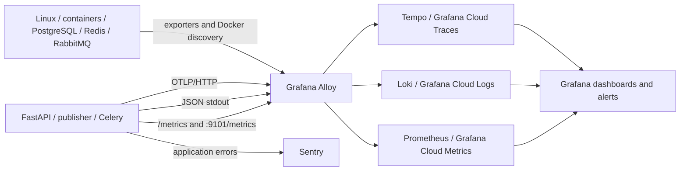

# Observability и диагностика

Все Task-команды выполняются из корня репозитория. Полный список: `task --list`.
Подробности о задаче: `task --summary <task>`.

Kantano использует единый контур метрик, структурированных логов и распределённых
трассировок. Контур охватывает HTTP API, фоновые процессы, realtime, базы данных,
очереди и Docker host. Ошибки приложения дополнительно поступают в Sentry.

В production телеметрия хранится в Grafana Cloud. Для разработки тот же набор сигналов
можно поднять локально на Prometheus, Loki, Tempo и Grafana. Прикладной код в обоих
окружениях использует одинаковые форматы и точки экспорта.

## Архитектура



Grafana Alloy является единственным агентом сбора. Он читает Docker logs, принимает
OTLP traces, опрашивает application и infrastructure endpoints и отправляет сигналы в
соответствующие хранилища. Недоступность Alloy или Grafana Cloud не влияет на результат
HTTP-запроса или Celery-задачи: экспорт выполняется вне бизнес-транзакции.

| Сигнал | Источник | Назначение |
|---|---|---|
| Метрики приложения | FastAPI, outbox publisher, Celery worker | Нагрузка, latency, ошибки, состояние pool, очередей и realtime |
| Метрики инфраструктуры | node exporter, cAdvisor, PostgreSQL, Redis, RabbitMQ, Alloy | Ресурсы host и контейнеров, доступность зависимостей, состояние экспорта |
| Логи | JSON stdout Docker-контейнеров | События приложения и корреляция по `request_id`/`trace_id` |
| Трассы | OpenTelemetry OTLP/HTTP | Путь запроса через HTTP, SQL, Redis, outbox, RabbitMQ, Celery и внешний HTTP |
| Ошибки | Sentry SDK | Обработанные 5xx и необработанные исключения backend-процессов |

Sentry не используется как второе хранилище логов или трасс: tracing, profiling и Logs
в SDK отключены.

## Инструментирование приложения

Каждый backend-процесс имеет отдельное OpenTelemetry-имя:

| Процесс | `service.name` |
|---|---|
| FastAPI | `kantano-api` |
| Outbox publisher | `kantano-outbox-publisher` |
| Celery worker | `kantano-celery-worker` |

`service.version` и Sentry release совпадают с `IMAGE_TAG`, который deployment workflow
задаёт равным short commit SHA. Метка `environment` разделяет local и production data.

В production используется `ParentBased(TraceIdRatioBased(1.0))`. Новый прикладной trace
записывается полностью, а фоновые операции наследуют sampling decision из W3C trace
context. Из телеметрии исключены health endpoints, `/metrics`, API-документация, local
static storage, пустые outbox polls и presence heartbeats.

HTTP access log содержит route template, method, status, duration, `request_id`,
`trace_id` и `span_id`. Контекст регистрации переносится через запись outbox и заголовки
Celery, поэтому один trace связывает API, publisher, broker, worker и email provider.

Диагностические данные не содержат пароли, токены, cookies, `Authorization`, Celery
args/kwargs, query string, SQL parameters и пользовательские объекты. SQLAlchemy работает
с `hide_parameters=True`. Идентификаторы сущностей, пользователей, запросов и задач не
используются как Prometheus или Loki labels, чтобы ограничивать кардинальность.

## Окружения и границы доступа

| Компонент | Local | Production |
|---|---|---|
| Сбор | Grafana Alloy | Grafana Alloy |
| Метрики | Prometheus, retention 24 часа | Grafana Cloud Metrics |
| Логи | Loki, retention 24 часа | Grafana Cloud Logs |
| Трассы | Tempo, retention 24 часа | Grafana Cloud Traces |
| Визуализация | Local Grafana | Grafana Cloud |
| Alerts | Загружены, но приостановлены | Grafana alerts → Telegram |

Local endpoints публикуются только на loopback. В production внешним остаётся только
Caddy на портах `80/443`; `/metrics`, OTLP, exporter ports и Alloy UI недоступны из
Интернета. Caddy удаляет входящие `traceparent`, `tracestate` и `baggage`, поэтому внешний
клиент не может задавать внутренний trace context или sampling decision.

cAdvisor работает внутри Alloy и требует host-level доступа. Контейнер Alloy запускается
с `privileged: true`, read-only mount-ами root filesystem, sysfs и Docker data, а также с
read-write доступом к `/var/run`. Alloy рассматривается как доверенный инфраструктурный
компонент: его UI не публикуется, а image и конфигурация обновляются вместе с Compose
stack.

## Конфигурация

Настройки приложения находятся под `LIGHTTASK_CONFIG__OBSERVABILITY__*`. Production
проверяет наличие Sentry DSN и OTLP endpoint, включённые metrics/tracing и JSON log format
до запуска backend-процессов.

| Параметр | Production value |
|---|---|
| `ENVIRONMENT` | `production` |
| `SERVICE_NAME` | задаётся Compose service |
| `VERSION` | `${IMAGE_TAG}` |
| `LOG_FORMAT` / `LOG_LEVEL` | `json` / `INFO` |
| `TRACING_ENABLED` / `METRICS_ENABLED` | `true` / `true` |
| `OTLP_ENDPOINT` | `http://alloy:4318/v1/traces` |
| `SAMPLING_RATE` | `1.0` |
| `SENTRY_DSN` | DSN backend-проекта |
| `BACKGROUND_METRICS_PORT` | `9101` |

Секреты разделены по потребителям:

| Файл | Содержимое |
|---|---|
| `.env` | Compose interpolation, PostgreSQL, RabbitMQ и monitoring role |
| `.env.backend` | Application credentials, Sentry и tracing settings |
| `.env.alloy` | Grafana Cloud ingestion endpoints и write token |
| `.env.gateway` | Hash пароля для Swagger |
| `.env.grafana` | Grafana API, datasource UIDs и Telegram |
| `.env.backup` | Restic и backup S3 |

Backend-процессы не получают Grafana credentials, а Alloy не получает JWT, S3, OAuth,
email и application database credentials. Ingestion token имеет только права записи
Metrics, Logs и Traces. Management token используется сервисным аккаунтом для управления
папкой, dashboards, alerts и notification policy. Полный список GitHub Actions Secrets
и Variables приведён в [руководстве по деплою](./deployment.md).

## Локальный запуск

Полное dev-окружение с observability и frontend запускается командой:

```bash
task obs
```

Чтобы поднять только Docker-часть в фоне, используйте `task obs:up`. Остановить стек
можно через `task obs:down`; observability volumes при этом сохраняются.

`grafana-provision` — одноразовый идемпотентный сервис. Его запускают после постоянных
сервисов: завершение с кодом `0` является штатным и не означает остановку Grafana.

| Интерфейс | Адрес |
|---|---|
| Grafana | `http://127.0.0.1:3000` |
| Prometheus | `http://127.0.0.1:9090` |
| Loki | `http://127.0.0.1:3100` |
| Tempo | `http://127.0.0.1:3200` |
| Alloy | `http://127.0.0.1:12345` |

Стандартные local credentials Grafana — `admin/admin`, если они не переопределены в
`.env`. Состояние сервисов и свежие логи проверяются командами:

```bash
docker compose -f docker-compose.dev.yml -f docker-compose.observability.yml ps
task obs:logs
```

## Dashboards

Grafana создаёт папку `Kantano` с тремя dashboards:

| Dashboard | Область диагностики |
|---|---|
| `Kantano / API` | Request rate, HTTP statuses, 5xx ratio, latency, in-progress requests, database pool и application logs |
| `Kantano / Background and realtime` | Outbox backlog и age, publisher/worker health, Celery attempts, RabbitMQ queue и WebSocket activity |
| `Kantano / Infrastructure and telemetry` | Scrape targets, host/container resources, dependencies, Alloy export и Grafana Cloud quota |

Dashboard variables фильтруют данные по `environment`; API dashboard дополнительно
выбирает `job`. Нулевой outbox отображается отдельно от отсутствующей метрики, а age
вычисляется только для положительного Unix timestamp. Shared gauges агрегируются в одну
серию, чтобы количество backend-процессов не искажало backlog и heartbeat.

## Прикладные метрики

Прикладные метрики можно найти по префиксам `kantano_` и `http_`. Остальные семейства
предоставляют exporters, Prometheus и Alloy.

| Метрика | Семантика |
|---|---|
| `http_requests_total` | Requests только по классу status: 2xx/3xx/4xx/5xx |
| `http_request_duration_seconds` | Histogram продолжительности HTTP requests по route template (`handler`); без method/status |
| `http_requests_inprogress` | Выполняющиеся HTTP requests |
| `kantano_db_pool_*_connections` | Размер, занятые connections и доступная ёмкость pool |
| `kantano_outbox_unpublished_events` | Текущий outbox backlog |
| `kantano_outbox_oldest_created_timestamp_seconds` | Timestamp старейшего неопубликованного event |
| `kantano_outbox_publish_total{result}` | Результаты публикации в RabbitMQ |
| `kantano_outbox_publisher_last_poll_timestamp_seconds` | Последний завершённый publisher poll |
| `kantano_outbox_stats_last_update_timestamp_seconds` | Последнее обновление outbox aggregates |
| `kantano_celery_task_attempts_total{task,result}` | Attempts, retries и результаты Celery tasks |
| `kantano_celery_task_final_failures_total{task}` | Tasks, исчерпавшие retries |
| `kantano_celery_task_attempt_duration_seconds` | Продолжительность одной попытки |
| `kantano_realtime_connections{kind}` | Активные user/project WebSocket connections |
| `kantano_realtime_errors_total{operation}` | Ошибки realtime publication и delivery |

## Production metrics contract

Все scrapes проходят через `prometheus.relabel.production_metrics` перед
`prometheus.remote_write.grafana_cloud`. Allowlist находится между маркерами
`BEGIN METRIC ALLOWLIST` и `END METRIC ALLOWLIST` в `config.prod.alloy`.

### Политика сбора

| Источник | Фильтрация |
|---|---|
| Application | Только метрики dashboards/alerts. HTTP: counter — `status` классами `2xx`–`5xx`; histogram — `handler`, `le`; in-progress — без HTTP labels. |
| Node | `cpu`, `filesystem`, `loadavg`, `meminfo`; CPU только `mode="idle"`; filesystem только `/`, без pseudo/ephemeral `fstype`. |
| cAdvisor | Project `lighttask_prod`, долгоживущие services и четыре используемые families. `name`/`image` удаляются; `id`/`cpu` сохраняются для уникальности. |
| PostgreSQL / Redis | `pg_up`, `redis_up` и `up`. |
| RabbitMQ | Aggregated `/metrics`, четыре используемые families и `up`; per-object metrics отключены. |
| Alloy | Используемые `otelcol_exporter_*`, `prometheus_remote_storage_*`, `loki_write_*` и `up`. |

`up` разрешён для девяти production jobs. Неиспользуемые families, `*_created`, histogram
`*_sum` и `*_count` отбрасываются. HTTP histogram buckets не изменены.

`grafanacloud_*` читаются из Grafana Cloud usage datasource и указаны в валидаторе как
external exceptions; VPS их не отправляет.

### Изменение контракта

1. Обновить instrumentation, dashboard/alert и allowlist.
2. Выполнить проверки:

   ```bash
   uv run --project backend/light_task python backend/light_task/scripts/validate_observability.py --inventory
   task obs:verify
   ```

Валидатор сверяет PromQL с allowlist, отклоняет неизвестные expressions/datasources и обход
production-фильтра. Изменения из Grafana UI необходимо экспортировать в репозиторий.

Disk policy предполагает размещение persistent data на `/`. Для отдельного mountpoint нужно
обновить одновременно relabel rules и PromQL.

## Production trace policy

| Suppression | Tracing сохраняется |
|---|---|
| Empty outbox SELECT, statistics query, presence heartbeat и background snapshot | Publish/dispatch, provider HTTP, realtime delivery и errors |

Sampler: `ParentBased(TraceIdRatioBased(rate))`. Переменная
`LIGHTTASK_CONFIG__OBSERVABILITY__SAMPLING_RATE`, default `1.0`; значения `0.5`, `0.25` и
`0.1` сохраняют примерно 50%, 25% и 10% root traces.

## Корреляция запроса

Backend возвращает `X-Request-ID` в HTTP response и сохраняет это значение в access log.
Поиск начинается в Grafana Explore с Loki query:

```logql
{environment="production"} |= "<request_id>" | json
```

Access log содержит нормализованный route, status и `trace_id`. По `trace_id` открывается
Tempo trace с FastAPI, SQLAlchemy, Redis и HTTPX spans. Для ответа 5xx связанный Sentry
event находится по tags `request_id` или `otel_trace_id`. Ожидаемые 4xx в Sentry не
отправляются; обработанный 5xx и необработанное исключение создают по одному error event.

Trace регистрации продолжается через `OutboxEvent.trace_context`, publisher span, W3C
headers сообщения RabbitMQ и Celery consumer span. Фоновые логи сохраняют исходный
`request_id` и добавляют `outbox_event_id`, `task_id` и `attempt`. После публикации token
удаляется из payload outbox.

Для диагностики остановившейся фоновой цепочки используются логи процессов и состояние
очереди:

```bash
docker compose -f docker-compose.prod.yml logs --since=15m \
  backend outbox-publisher celery-worker rabbitmq
docker compose -f docker-compose.prod.yml exec -T rabbitmq \
  rabbitmqctl list_queues name messages_ready messages_unacknowledged consumers
```

## Alerts

Production provisioning создаёт 15 Grafana rules и отправляет fire/recovery notifications
в Telegram. Local rules загружаются приостановленными. Исходные выражения находятся в
`observability/grafana/alert-rules.json` и всегда ограничены
`environment="production"`.

| Группа | Контролируемое состояние |
|---|---|
| Availability | Исчезновение scrape targets; PostgreSQL, Redis или RabbitMQ недоступны |
| API | 5xx выше 5% при достаточном трафике; p95 выше одной секунды |
| Background | Старый outbox event, stale publisher/statistics heartbeat, очередь без consumer, исчерпанные Celery retries |
| Resources | Менее 10% свободной памяти, менее 15% filesystem, container OOM |
| Telemetry | Исчезновение Alloy, failed/dropped exports, заполнение Grafana Cloud quota на 80% |

Alert указывает на симптом, а не заменяет диагностику. API-инцидент исследуется от
dashboard к access log, trace и Sentry. Background-инцидент сопоставляется с outbox age,
publisher heartbeat, RabbitMQ ready/unacknowledged messages и worker logs. Resource alert
проверяется по host metrics, `docker stats`, restart count и `.State.OOMKilled`.

## Проверка конфигурации

Локальные Compose-конфигурации, Alloy, Loki, Tempo и Grafana assets проверяются одной
командой:

```bash
task obs:verify
```

Production Compose и production Alloy config полностью проверяются в CI перед деплоем.
`task obs:verify` является статической локальной проверкой и не доказывает доставку
telemetry во внешнюю Grafana Cloud.

После запуска проверяется не только health status, но и прохождение каждого сигнала:

1. выполнить прикладной HTTP request и сохранить `X-Request-ID`;
2. найти соответствующую метрику и JSON log;
3. открыть Tempo trace по `trace_id` из лога;
4. выполнить фоновый сценарий регистрации и проверить продолжение trace в worker;
5. проверить Alloy failed/dropped counters и свежие container logs.

Tempo может один раз сообщить об отключённом optional metrics-generator, Loki — об empty
ring до регистрации single-binary ingester, а Tempo после принудительной остановки — об
удалении незавершённого WAL head. После readiness эти сообщения не должны повторяться.
Продолжающиеся exporter errors, tracebacks, panic, restart loop или OOM означают ошибку
конфигурации или runtime.

Для изолированной проверки email retry используется
`docker-compose.observability.verify.yml`. Overlay заменяет endpoint Celery email gateway
на локальный fake provider и не затрагивает остальные сервисы.

| Режим provider | Ожидаемый результат |
|---|---|
| `success` | Одна принятая попытка и заполненный `email_sent_at` |
| `transient_once` | HTTP 503, затем success с тем же idempotency key и новым attempt span |
| `fail_always` | Шесть попыток, пять retries и один final failure |

```bash
docker compose -f docker-compose.dev.yml -f docker-compose.observability.yml \
  -f docker-compose.observability.verify.yml \
  up -d --build --wait backend celery-worker outbox-publisher fake-email alloy prometheus loki tempo grafana
curl -fsS -X POST http://127.0.0.1:18080/__control \
  -H 'Content-Type: application/json' -d '{"mode":"transient_once"}'
```

Fake provider публикуется только на `127.0.0.1:18080`, не отправляет письма и не хранит
их тело или Authorization header.

## Production provisioning

Deployment выполняется workflow `.github/workflows/deploy.yml`. Один image tag передаётся
FastAPI, publisher и worker; до restart проверяются Compose, Alloy и Caddy. После Alembic
migrations workflow ждёт readiness, проверяет telemetry endpoints и идемпотентно применяет
Grafana folder, datasources, dashboards, alerts, Telegram contact point и notification
policy. При ошибке запуска используется предыдущий image tag.

Grafana resources применяются скриптом `observability/grafana/apply.py` через HTTP API:

```bash
docker run --rm --env-file .env.grafana \
  -v "$PWD/observability/grafana:/work:ro" \
  python:3.12-alpine python /work/apply.py
```

Подготовка VPS, GitHub Secrets/Variables и ручной Compose deploy описаны в
[руководстве по деплою](./deployment.md).

## Отказ и восстановление telemetry pipeline

Буферы экспорта ограничены. Prometheus remote-write WAL хранится до часа; trace queue
содержит до 1024 batches и повторяет отправку не более 60 секунд. Alloy сохраняет позиции
чтения Docker logs, но не гарантирует неограниченный replay при длительной недоступности
Loki endpoint.

При отказе сохраняются Alloy logs и значения failed/dropped/queue counters до изменения
конфигурации. После восстановления endpoint или credentials выполняется один
контролируемый API request и проверяется появление нового log, trace и metric. Рост error
counter должен прекратиться, а очереди — вернуться к нулю. Интервал, вышедший за пределы
буферов, фиксируется как возможная потеря телеметрии.

Повторные restart Alloy до фиксации состояния нежелательны: они уменьшают вероятность
replay. Отказ observability-контура не должен изменять business response API или Celery.

## Ограничения и ресурсы

- Frontend не инструментирован: browser errors, Web Vitals и frontend traces отсутствуют.
- Sampling `1.0` не гарантирует доставку при потере процесса или переполнении buffers.
- Local Tempo использует filesystem backend и предназначен только для разработки.
- Node metrics в Docker Desktop описывают Linux VM, а не Windows host.
- Grafana Cloud retention и quota определяются активным plan.

Целевой production host имеет 2 vCPU, 2 ГБ RAM и 40 ГБ NVMe. Потребление фиксируется до
rollout, после smoke, через 30 минут фоновой нагрузки и через 24 часа:

```bash
date -Is
free -m
df -h
docker stats --no-stream
docker compose -f docker-compose.prod.yml ps --all
docker inspect -f '{{.Name}} restart={{.RestartCount}} oom={{.State.OOMKilled}}' \
  $(docker compose -f docker-compose.prod.yml ps -q)
```

В Grafana Usage отдельно контролируются active series, текущее и прогнозируемое месячное
потребление logs и traces. Устойчивый OOM, restart loop, ошибки smoke или продолжающиеся
export failures означают, что размещение не прошло эксплуатационную проверку.
